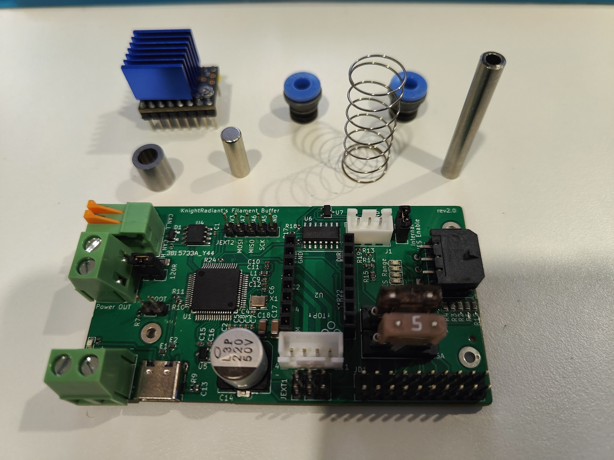

# OpenAMS filament buffer, filament sensor, and stepper follower (FPS)

This project solves the problem of long reverse bowden tube friction in 3D printers, specially as it pertains to MMUs (such as ERCF).The purpose of the filament buffer is to add a small amount of pressure to the filament path between the extruder and the spool via a stepper motor.

This mechanism is used to *lift* the filament up to the extruder, and to *pull* the filament down from the spool. The stepper motor is controlled by a PID loop, which is tuned to maintain a constant pressure on the filament.  This pressure is measured by the HES sensor on the PCB.  The stepper motor is driven by a TMC2209 stepper driver, which is controlled by an STM32 MCU.
Here you can find all of the files needed to build your own OpenAMS filament buffer, filament sensor, and stepper follower.  
This is a work in progress, so please check back often for updates.

## Bill of Materials

| Item | Quantity |
| ---- | -------- | 
| ECAS04 | 2 |
| 8mm OD x 5mm ID x 10mm length oiless bearing | 1 |
| 5mm Diameter x 15mm length magent | 1 |
| 5mm OD x 3mm ID x 37mm length stainless steel tube | 1 |
| 13mm OD x 0.6mm wire size x 30mm length spring | 1 |
| TMC2209 stepper stick | 1 |
| ACE FPS PCB | 1 |

## STLs

Print the following STLs:\
[Buffer Slider](STLs/rev1.0/buffer-slider.stl)\
[Buffer Slider Base](STLs/rev1.0/buffer-slider-base.stl)

If installing standalone, print the following STLs:

[Front Case](STLs/rev1.0/standalone-front.stl)\
[Front Cover](STLs/rev1.0/case-cover.stl)

If installing in the rear of a Voron Trident or 2.4, print the following STLs:\

[Font Case](STLs/rev1.0/voron-case-front.stl)\
[Rear Case](STLs/rev1.0/voron-case-rear.stl)\
[Front Cover](STLs/rev1.0/case-cover.stl)\

## Installed in a Voron 2.4

